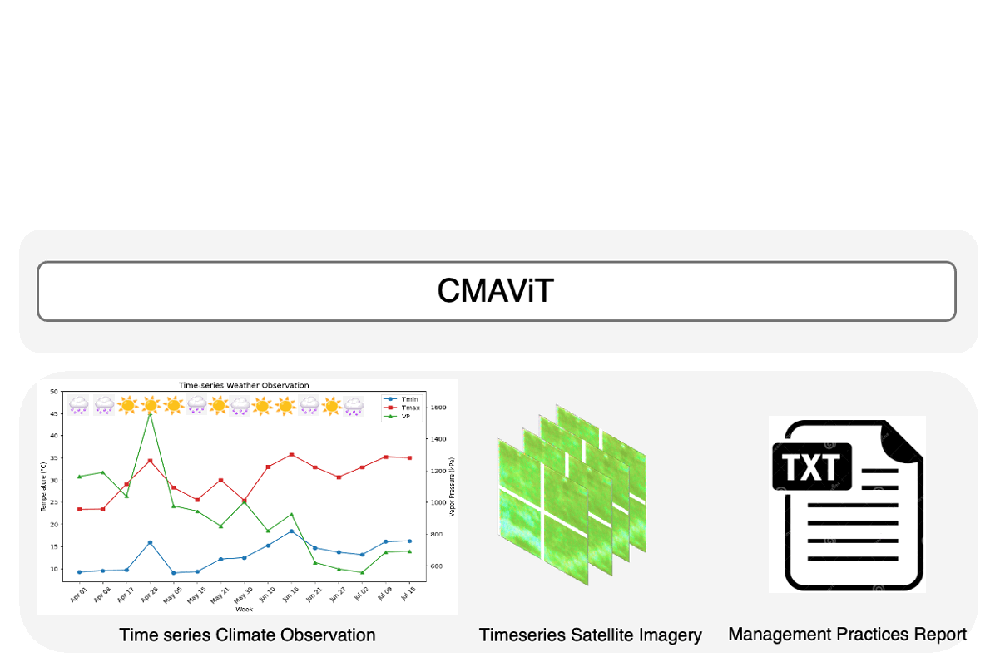
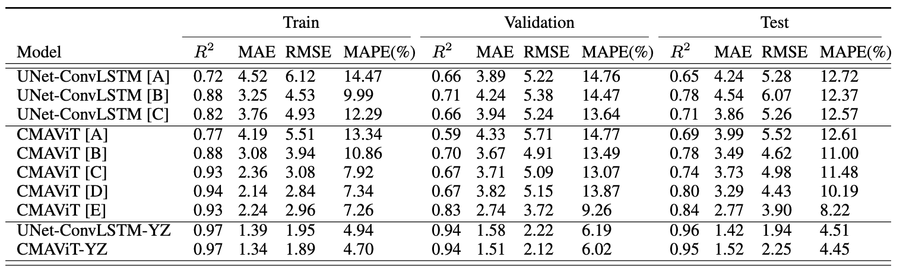
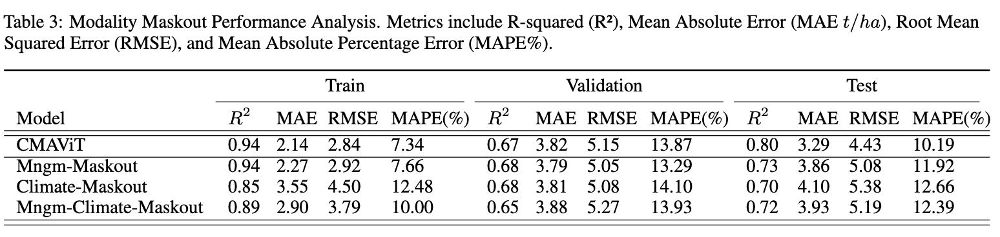

# CMAViT: Integrating Climate, Management, and Remote Sensing Data for Crop Yield Estimation with Multimodal Vision Transformers

Crop yield prediction is a critical task for agricultural planning, yet it remains challenging due to the intricate interplay between weather, climate, and management practices. To overcome these challenges, we present **Climate-Management Aware Vision Transformer (CMAViT)**, a deep learning-based multimodal model specifically designed for pixel-level vineyard yield prediction.

CMAViT leverages both spatial and temporal data by integrating remote sensing imagery and short-term meteorological data, effectively capturing variations during the growing season. Additionally, it incorporates management practices represented in text form, employing a cross-attention encoder to model their interaction with time-series data.

  
*Figure 1: CMAViT workflow showcasing data integration and prediction pipeline.*

---

## Model Performance

CMAViT achieves state-of-the-art performance for vineyard yield prediction, demonstrating its ability to accurately model the complex interactions among climate, management, and remote sensing data.

  
*Figure 2: Performance comparison of CMAViT against baseline models.*

---

## Impact of Masked Modalities

To evaluate the importance of each data modality, we performed ablation studies by masking specific inputs (e.g., management data, meteorological data, or remote sensing imagery). The results highlight the significant contribution of integrating multimodal inputs to achieve robust predictions.

  
*Figure 3: Impact of masked modalities on model performance.*

---

## Requirements

Before running the code, ensure you have the following dependencies installed:

- **Python**: 3.11  
- **PyTorch**: > 2.0  
- **NumPy**: For numerical operations  
- **Pandas**: For data manipulation  
- **Matplotlib & Seaborn**: For visualization  


## Repository Structure

├── inference/
│   ├── inference.py         # Modules for inference
│   ├── CMAViT.ipynb         # Notebook for CMAViT model performance
│   ├── sensivity_ana.ipynb  # Maskout sensitivity analysis
│   └── spatial.ipynb        # Spatial variability analysis
├── models/
│   ├── attention.py         # Self-attention modules
│   ├── cnns.py              # UNet-ConvLSTM model
│   ├── CMAViT.py            # CMAViT model implementation
│   ├── engine.py            # Auxiliary modules for training and evaluation
│   └── config.py            # Configuration and auxiliary information
├── src/
│   ├── dataloader.py        # Data loading and preprocessing scripts
│   ├── losses.py            # Loss functions
│   ├── figs/                # Figures and visualizations
│   ├── util.py              # Utility functions
│   └── RWSampler.py         # Random Weighted Sampler
├── notebooks/               # Jupyter notebooks for exploratory analysis
├── README.md                # Project documentation
└── run.py                   # Main script for training and evaluation

```bash
python run.py --exp_name my_experiment --batch_size 64 --in_channels 4 --dropout 0.1 --lr 0.0001 --wd 0.0001 --epochs 50 --loss mse

